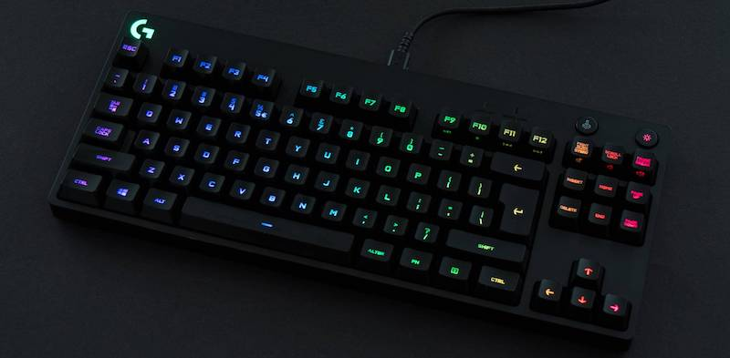
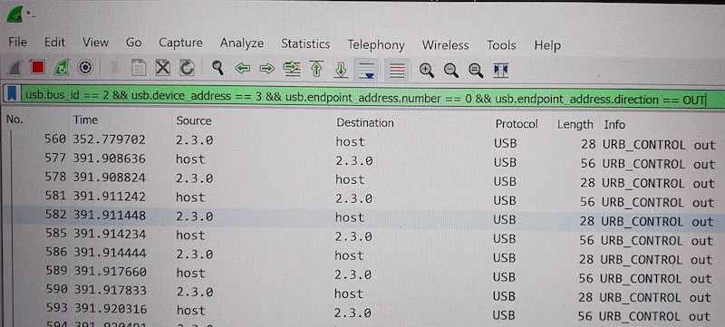

# kbdctl

I bought a Logitech G Pro TKL RGB keyboard a few weeks ago, and now I'm sick and tired of the `Logitech G HUB` bloatware I need to install just to alter the lightshow. This is why I'm writing this barebones cli controller, to finally take care of business.

## ToDo

- [X] Locate the keyboard and get a handle to it
- [X] Apply static color
- [X] Apply built in animation
- [ ] Apply custom key lighting (per key & key groups)
- [ ] Create custom animations using key-array frames
- [ ] Turn this into a daemon using web-sockets
- [ ] Add the ability to store settings on profiles
- [ ] Just maybe... add a GUI?

## Usage

The controller will only work with the G-Pro, as protocols are not open-source and I'm neither having other keyboards within reach nor the time and dedication to work their protocols out. This is more of a hobby/fun project. To use the software, you only need `hidapi`. The makefile specifies dependencies in homebrews directory (`/opt/homebrew`), if you got your dependencies from somewhere else, alter the makefile.

After making sure the dependency is installed, just run `make`, or `make clean && make` after changes.

## Reversing The Protocol

As there is no documentation available for the protocol and I don't just want to copy and paste random code from github, I'm actually trying to reverse engineer the protocol on my own, to learn something along the way.

To capture packets sent out from [Logitech G HUB](https://www.logitechg.com/de-at/innovation/g-hub.html) I'm using [USBPcap](https://github.com/desowin/usbpcap) in combination with [Wireshark](https://www.wireshark.org) to live-capture all packets using the following commmand:

`USBPcapCMD.exe -d \\.\USBPcap2 -A -o - | "C:\Program Files\Wireshark\Wireshark.exe" -k -i -`

Where `-d \\.\USBPcap2` means that I want to capture "controller" 2 (could differ for your setup) and `-A` includes all devices on this "controller" (as the docs on USBPcap are not too clear on how to filter at this stage). This will open a new instance of Wireshark which will now display captured packets.

After observing for a while, I came up with this filter in order to only end up with control packets:

So... all that's left to do now is to play around with the settings in logitech's software and find byte-patterns. All documentation of the protocol will be located at `include/ctl_frame.h`.